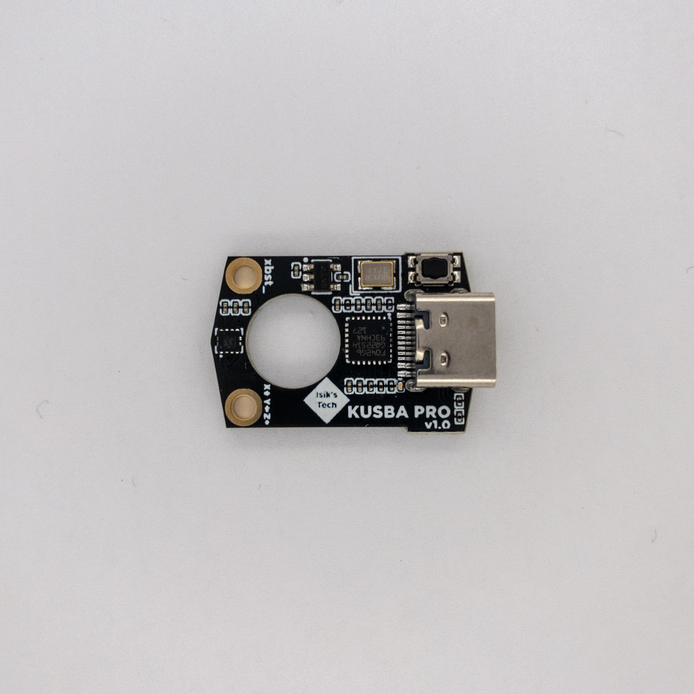

# WIP!!! EVERYTHING IN THIS BRANCH IS TBD
# KUSBA Pro (Nozzle KUSBA)
[YouTube Video](https://www.youtube.com/watch?v=ecENeHfXG64)

## Purchasing a KUSBA Pro
### United States
- [Isik's Tech](https://store.isiks.tech/products/kusba-pro) (Me)
- [XR Bunker](https://xrbunker.works/products/kusba-pro-nozzle-usb-accelerometer-by-xbst_isik)
### United Kingdom
- [Printy Please](https://www.printyplease.uk/KUSBAPro)
### European Union
- [Lab4450 - Portugal](https://lab4450.com/product/nozzle-kusba-pro-accelerometer/)
### Australia
- [DREMC](https://store.dremc.com.au/products/kusba-pro-usb-accelerometer-for-klipper-adxl345)

This project is licensed under [GPL v3](./LICENSE), meaning vendors are allowed to sell PCBs without paying me. If you'd like to support the development of this and future projects please consider [sponsoring](https://github.com/sponsors/xbst) me on GitHub. You can also subscribe on [Patreon](https://l.isiks.tech/patreon) or [YouTube](https://l.isiks.tech/member).

You can also use the included gerber files to order your own from a PCB manufacturer like [PCBWay](https://www.pcbway.com/setinvite.aspx?inviteid=374841) or [JLCPCB](https://jlcpcb.com/) and you can order the MJF mount from a 3D printing company like [JawsTec](https://www.jawstec.com/3d-printing-service/?aff=6).
 

## Instructions

- [LIS2DW KUSBA Pro (v1.0) Firmware Flashing & Usage](./Docs/Firmware.md)
- [ADXL345 KUSBA Pro (v2.0) Firmware Flashing & Usage](./Docs/Firmware-v2.md)
- [Assembling PCB and MJF Mount](./Docs/Mount.md)

## KUSBA v2.4 vs Pro v1.0 vs Pro v2.0

|             |KUSBA Pro v2.0|KUSBA Pro v1.0|KUSBA v2.4|
|-------------|--------------|--------------|----------|
|Picture      ||||
|MCU          |STM32G431     |STM32F042     |RP2040    |
|Accelerometer|ADXL345       |LIS2DW        |ADXL345   |
|3.3V Regulator|LP5907MFX-3.3|LP5907MFX-3.3|AMS1117-3.3|
|Flash        |N/A           |N/A         |W25Q16JVSNIQ|
|Connector    |USB C         |USB C         |USB C     |
|Firmware     |Klipper       |Klipper  |Klipper, Rampon|
|PCB Size     |26.0 x 17.6 mm|26.0 x 17.6 mm|34.0 x 25.0 mm|
|Smallest SMD |0402          |0201          |0402      |

## YouTube

I am a YouTube content creator. If you want content about these projects & more, please consider [subscribing to my YouTube channel](https://www.youtube.com/channel/UClAWYmCkHjsbaX9Wz1df2mg).
 

If you feel like contributing to the development of this project and other projects like this you can sponsor me on [GitHub](https://github.com/sponsors/xbst), subscribe on [Patreon](https://l.isiks.tech/patreon) or [YouTube](https://l.isiks.tech/member).

## Notes
- Readme files in this repo may contain Amazon Associate, Aliexpress affiliate, PCBWay affiliate, JawsTec affiliate links. I make a comission on qualifying purchases.
- This project does not come with any warranty, if you choose to build/use a PCB manufactured using published files in this repository, you are doing this at your own risk!
- If you want to sell PCBs manufactured using published files in this repository, you are allowed to, and you will not owe me any royalties. **You cannot claim that I endorse the sale**. You can check the license file for more information. However, if you **wish** to give me a share you can sponsor me on [GitHub](https://github.com/sponsors/xbst), subscribe on [Patreon](https://l.isiks.tech/patreon) or [YouTube](https://l.isiks.tech/member).
